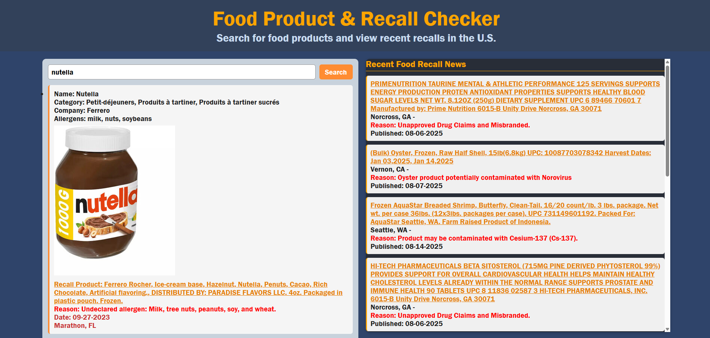

# Product Info and Food Recall Alerts

# Description
This website enables user to look up if a product has been recalled and catch up on recent food recall news

## How It's Made:
Tech used: 
- HTML
- CSS
- JavaScript
- API

## Lessons Learned:
- How to integrate API database into JS

## Notes
- Would like to commit better styling to website

## Future Updates
- Adding an image search or barcode scan option

#### API Used
- Open Food Facts : https://world.openfoodfacts.net/api/v2/product/3017624010701?fields=product_name,nutriscore_data   
- FSIS Food Recall : https://www.fsis.usda.gov/fsis/api/recall/v/1 

